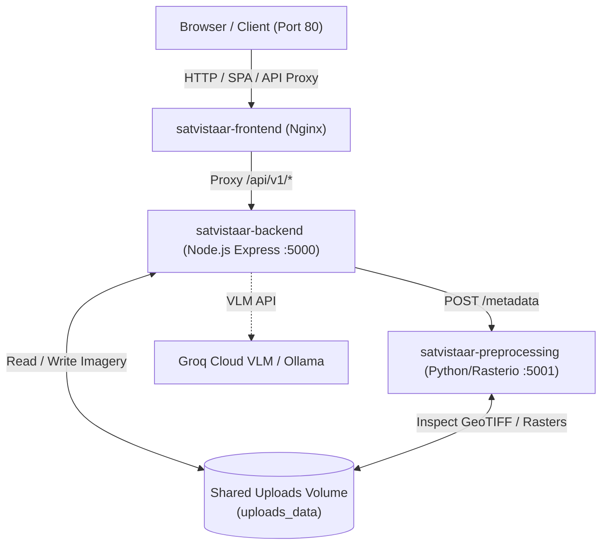

# 🐳 SatVistaar Docker Deployment Guide

This guide outlines how to build, run, and manage **SatVistaar** using Docker and Docker Compose.

---

## 🏗️ Architecture Overview

The system runs across 3 orchestrated microservices:



| Container Name | Technology | Internal Port | Host Port | Purpose |
|---|---|---|---|---|
| `satvistaar-frontend` | React 19 + Vite + Nginx | `80` | `80` | SPA Static hosting & reverse proxy |
| `satvistaar-backend` | Node.js 20 Express | `5000` | `5000` | REST API, auth, ML inference agent |
| `satvistaar-preprocessing` | Python 3.11 + Rasterio + GDAL | `5001` | `5001` | Geospatial raster & GeoTIFF processing |

---

## 🚀 Quick Start

### 1. Prerequisites
- [Docker Desktop](https://www.docker.com/products/docker-desktop/) (Windows/macOS) or Docker Engine + Docker Compose Plugin (Linux).

### 2. Configure Environment Variables
Copy `.env.docker.example` to `.env` or set your keys in `.env`:
```bash
cp .env.docker.example .env
```
Ensure your `GROQ_API_KEY` (and any desired JWT secrets) are configured in `.env`.

### 3. Build and Start All Services
```bash
docker compose up --build -d
```

### 4. Access the Application
- **Web UI & App**: [http://localhost](http://localhost) (or port `80`)
- **Backend API**: [http://localhost:5000/api/v1/health](http://localhost:5000/api/v1/health)
- **Preprocessing Service**: [http://localhost:5001/health](http://localhost:5001/health)

---

## ⚙️ Useful Docker Commands

### View Running Containers & Health
```bash
docker compose ps
```

### Stream Live Logs
```bash
# All containers
docker compose logs -f

# Specific container
docker compose logs -f backend
docker compose logs -f preprocessing
docker compose logs -f frontend
```

### Restart Services
```bash
docker compose restart
```

### Stop and Tear Down
```bash
# Stop containers
docker compose down

# Stop containers and remove persisted volumes (resets uploads)
docker compose down -v
```

---

## 🛠️ Configuration Reference

| Environment Variable | Default | Description |
|---|---|---|
| `FRONTEND_PORT` | `80` | Host port mapped to Nginx web frontend |
| `BACKEND_PORT` | `5000` | Host port mapped to Express backend |
| `PREPROCESSING_PORT` | `5001` | Host port mapped to Python microservice |
| `GROQ_API_KEY` | `""` | API key for high-speed cloud VLM inference |
| `GROQ_MODEL` | `qwen/qwen3.6-27b` | Model identifier on Groq |
| `ML_MODE` | `real` | Set to `real` for live inference, `mock` for testing |
| `JWT_SECRET` | auto | Secret key used to sign session JWTs |
| `MAX_UPLOAD_SIZE_MB`| `100` | Maximum file upload size for satellite imagery |
