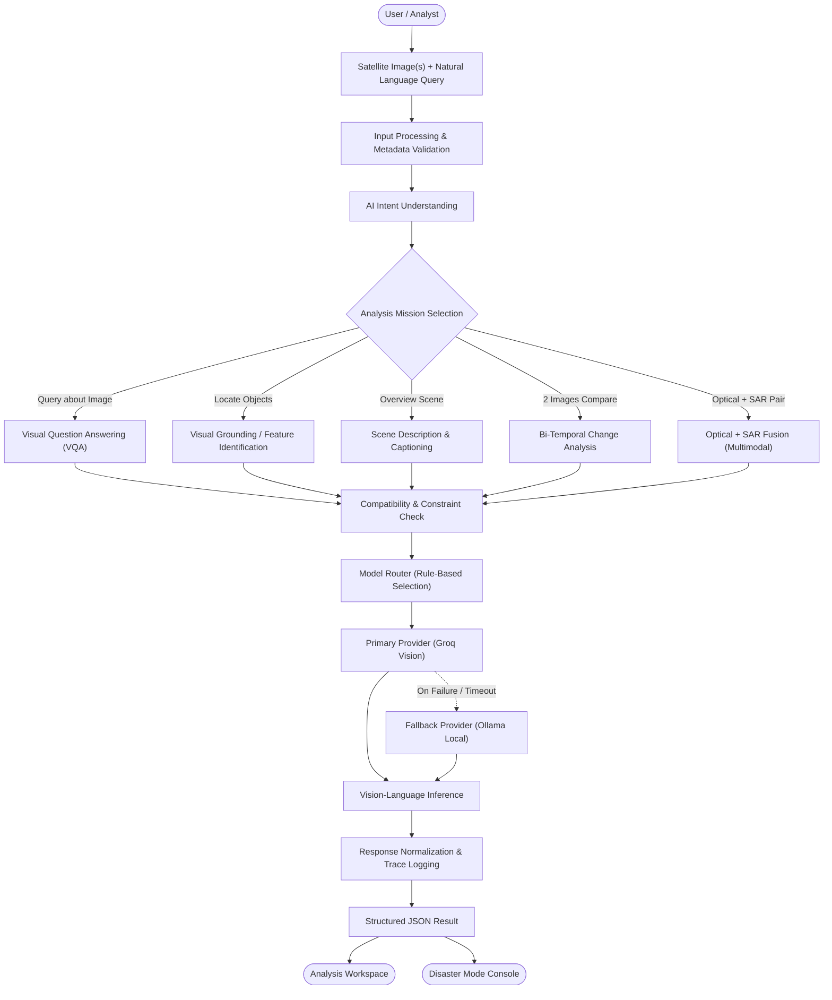
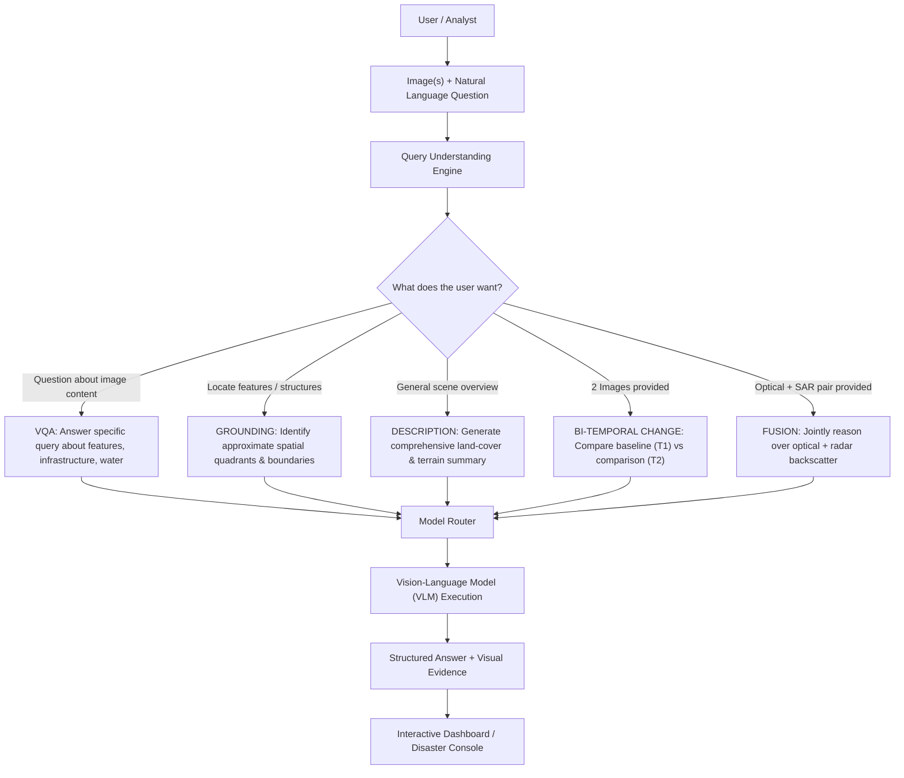
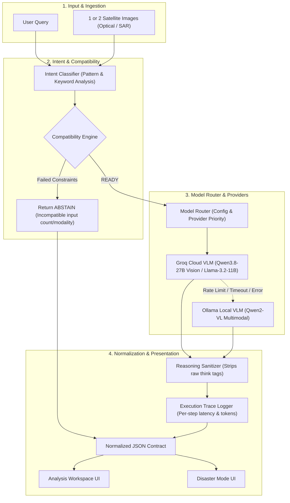
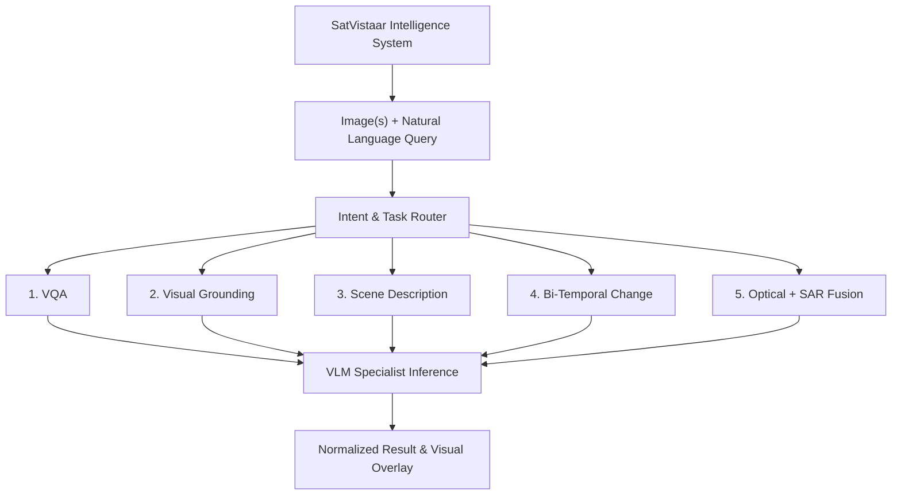
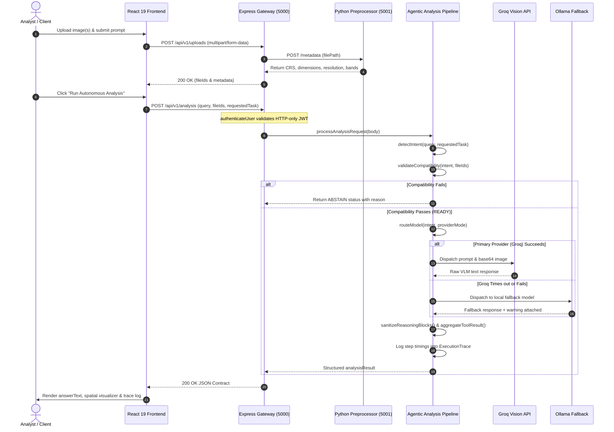

# SatVistaar 🛰️

**Agentic Vision-Language Platform for Multimodal Remote-Sensing Intelligence**

[](https://claude.ai/chat/backend) [](https://claude.ai/chat/frontend) [](https://claude.ai/chat/backend/services/preprocessing) [](https://claude.ai/chat/backend/src/auth) [](https://claude.ai/chat/backend/src/providers) [](https://claude.ai/chat/e4ea33f9-a878-4b2a-93fc-018f7bc9d662#)

> **Image(s) + Question → Intent → Mission → Model → Vision Analysis → Structured Result → Visual Dashboard / Disaster Response Console**


## 📌 Overview

**SatVistaar** (developed for **Problem Statement SIH26167 — "SatQuery AI"**, Team **PRAXIS**, Department of Space / ISRO) is an agentic, query-driven geospatial intelligence platform that lets analysts interrogate satellite imagery in plain language instead of hand-building GIS workflows.

The platform now spans two live surfaces:

1.  **Analysis Workspace** — the original conversational VQA/grounding/change-detection console.
2.  **Disaster Mode** — a newly observed operational console for hazard mapping, incident prioritization, and rapid-response decision support (flood response is the concrete example currently in the product).

The system's agentic pipeline combines:

1.  **Natural Language Intent Detection** — classifies each query into one of five missions (see below).
2.  **Geospatial Metadata Extraction** — a Python/Rasterio microservice extracting CRS, bounding boxes, dimensions, and band configuration from GeoTIFF, TIFF, PNG, and JPEG imagery.
3.  **Model Router & Deterministic Fallback** — routes inference to a cloud VLM (**Groq**, `Qwen3.8-27B Vision`) with automatic fallback to a local model (**Ollama**, `qwen2-vl`) on timeout/rate-limit.
4.  **Interactive Spatial Visualization** — quadrant-style grounding overlays, bi-temporal swipe/side-by-side comparisons, and (in Disaster Mode) layered hazard/priority-zone maps.
5.  **Secure Full-Stack Authentication** — bcrypt-hashed credentials, JWTs in HTTP-only cookies, and protected routes.

> [!NOTE] **MVP Scope Boundary** (confirmed by the product's own in-app "Capabilities & Limitations" page): SatVistaar's Vision-Language Models are strong at qualitative reasoning, feature description, and change narration — **not** at calibrated spectral indices (e.g. true NDVI rasters), pixel-level segmentation masks, or physical (tensor-level) optical–SAR wave fusion. Bounding overlays reflect model attention, not survey-grade shapefiles.

> [!IMPORTANT] The **SIH26167 problem statement mandates** remote-sensing-specific fine-tuning/domain adaptation (e.g. on BigEarthNet) and genuine co-registered optical–SAR joint analysis. As of this writing, the observed pipeline uses **general-purpose vision-language models** (Qwen/Llama family via Groq and Ollama) without confirmed domain fine-tuning. This is tracked as an open compliance gap in [Limitations](https://claude.ai/chat/e4ea33f9-a878-4b2a-93fc-018f7bc9d662#%EF%B8%8F-limitations) and [Roadmap](https://claude.ai/chat/e4ea33f9-a878-4b2a-93fc-018f7bc9d662#-roadmap).

----------

## 💡 What Makes SatVistaar Different?

-   **Natural Language Driven** — ask direct questions instead of writing GIS scripts.
-   **Five-Mission Unified Architecture** — VQA, Scene Description, Visual Grounding, Bi-Temporal Change, and Optical + SAR Fusion in a single interface.
-   **Automatic Intent Classification** — queries are routed to the correct mission without the user choosing a "tool."
-   **Compatibility Validation Before Execution** — checks image count, format, and modality before invoking a VLM, avoiding wasted inference calls.
-   **Provider-Agnostic Model Routing with Graceful Fallback** — Groq Cloud VLM primary, local Ollama daemon as deterministic fallback.
-   **Structured JSON Contracts** — normalized output, sanitized reasoning, and per-step timing traces for the UI.
-   **Operational Mode for Disaster Response** — a second console (Disaster Mode) turns the same underlying pipeline into an incident/hazard-prioritization tool, not just a Q&A box.

----------

## ⚠️ Problem Statement

**SIH26167 — SatQuery AI: An Interactive Vision-Language Assistant for Multimodal Remote Sensing Image Analysis through Text Queries** (Department of Space / ISRO).

The PS requires a system that can:

-   Answer natural-language questions about **single** optical/multispectral or SAR images (VQA is mandatory; captioning **or** grounding must also be implemented).
-   Perform **change description / change-VQA** over **bi-temporal** image pairs (mandatory).
-   Perform **joint analysis of co-registered optical + SAR pairs** (mandatory).
-   Use **agentic orchestration** — interpret the query, check input compatibility, select the right specialist model/tool, execute, and return an auditable execution trace.
-   Include at least one **remote-sensing fine-tuned/adapted** vision component (BigEarthNet or other open RS training data) — a generic, un-adapted LLM/VLM does not satisfy the PS.
-   Be evaluated against public benchmarks (VRSBench, RSVQA, CDVQA) and an ISRO/SAC Cartosat-2S + RISAT evaluation set.

SatVistaar's current implementation satisfies the **interaction and orchestration shape** of this brief (five missions including Optical+SAR, agentic routing, compatibility checks, execution traces) but has **not yet demonstrated** the mandatory fine-tuning/domain-adaptation requirement — see [Limitations](https://claude.ai/chat/e4ea33f9-a878-4b2a-93fc-018f7bc9d662#%EF%B8%8F-limitations).

----------

## 🛰️ SatVistaar Intelligence Pipeline



----------

## 🧠 From Question to Intelligence



----------

## 🤖 AI Decision Architecture



----------

## 🎯 Five Analysis Missions



### 1. Visual Question Answering (VQA)

Open-ended questions about visible features (_"Is there an airport runway visible?"_). **Status: Implemented.**

### 2. Visual Grounding / Feature Identification

Approximate spatial quadrants/bounding regions for requested features. **Status: Implemented (Qualitative).**

### 3. Scene Description & Captioning

High-level land-cover and terrain summaries. **Status: Implemented.**

### 4. Bi-Temporal Change Analysis

Compares a baseline (T1) and comparison (T2) image pair for qualitative change narration. **Status: Implemented (Qualitative).**

### 5. Optical + SAR Fusion _(New — not in previous README)_

Selectable in the live workspace as a **"Multimodal"** task: jointly reasons over a co-registered optical image and a SAR image to describe built-up/water-covered regions and cross-modal features. **Status: 🚧 Implemented at the UI/task-routing level; the underlying joint optical–SAR reasoning pipeline (vs. general VLM prompting) is not independently verified.**

----------

## 🚨 Disaster Response Console _(New Section — not present in the previous README)_

Alongside the Analysis Workspace, the live application exposes a dedicated **Disaster Mode**, observed in a walkthrough of a flood-response scenario:

-   **Incident setup**: select a target AOI boundary, incident type (e.g. Flood), and baseline/incident timestamps.
-   **Multi-sensor feed selection** before running disaster analysis.
-   **Operational dashboard**: rainfall, water level, area/population at risk, and an overall priority/severity score, alongside a ranked list of recommended actions (e.g. prioritized evacuation zones, infrastructure at risk) with confidence framing.
-   **Layered hazard map** with toggleable layers: Base Imagery, Hazard Footprint, Damage Level, Critical Infrastructure & Roads, Priority Zones (P1–P10), and an Uncertainty/Speckle layer.
-   **Comparison tooling**: swipe, side-by-side, incident-marker, and draw-AOI modes over the hazard map.
-   **Forward-looking risk framing** ("What could happen next?") and export/download of the map and report.

> **Verification note:** This module was confirmed via a recorded walkthrough of the live UI, not via source inspection (repository subpaths were not crawlable in this session) or the repository's own README, which does not mention Disaster Mode at all. Backend logic, data sources for hazard/priority-zone layers, and whether outputs are model-generated vs. rule-based were **not verifiable** and should be confirmed with the engineering team before being publicly claimed as "AI-generated hazard intelligence."

----------

## 🚀 Current MVP Capabilities Matrix

Capability

Input

Current Implementation

Status

**Visual Question Answering (VQA)**

1 image + question

Natural-language reasoning over visible land cover, infrastructure, water, terrain via VLM.

✅ **Implemented**

**Scene Description / Captioning**

1 image + prompt

High-level spatial overview and land-cover summary.

✅ **Implemented**

**Visual Grounding / Feature ID**

1 image + query

Approximate relative spatial bounding regions/quadrants.

✅ **Implemented** (Qualitative)

**Bi-Temporal Change Analysis**

2 temporal images + query

Comparative T1 vs T2 analysis with timeline metadata.

✅ **Implemented** (Qualitative)

**Optical + SAR Fusion**

Co-registered optical + SAR pair

Selectable "Multimodal" mission in the live workspace.

🚧 **UI-Implemented**, fusion depth unverified

**Disaster Mode / Hazard Console**

AOI + incident params + imagery

Incident dashboard, layered hazard map, priority actions, export.

🚧 **Implemented (UI-confirmed)**, backend logic not yet verified

**Cloud VLM Inference (Groq)**

Image + prompt

`Qwen3.8-27B Vision` with 429 backoff/retry.

✅ **Implemented**

**Local VLM Inference (Ollama)**

Image + prompt

Local `qwen2-vl` daemon adapter.

✅ **Implemented** (Fallback)

**Provider Fallback Engine**

Analysis request

Deterministic fallback on primary failure/timeout.

✅ **Implemented**

**Geospatial Preprocessing Microservice**

GeoTIFF/TIFF/JPEG/PNG

Flask + `rasterio`/`PIL` metadata extraction (CRS, dims, resolution, bands).

✅ **Implemented**

**Intent Detection & Compatibility Engine**

Query + file metadata

Classifies task, enforces image-count rules, returns `READY`/`ABSTAIN`/`UNKNOWN`.

✅ **Implemented**

**Execution Trace & Normalization**

Analysis lifecycle

Latency/token stats, strips raw `<think>` blocks.

✅ **Implemented**

**Authentication & Route Protection**

Credentials / cookies

JWT in HTTP-only cookie, bcrypt hashing, `/auth/me` session hydration.

✅ **Implemented**

**Interactive Analysis UI**

React 19 frontend

Dark glassmorphism workspace, live model-routing sidebar, pipeline-flow tracker.

✅ **Implemented**

**Remote-sensing fine-tuning / domain adaptation**

Training pipeline

PS-mandatory; not evidenced in live product or repo README.

❌ **Not yet verified**

_Pixel-Level Semantic Segmentation_

Raster

Calibrated pixel segmentation masks.

📋 _Planned_

_Physical Optical–SAR Tensor Fusion_

Optical + SAR

Radiometric fusion at tensor level (vs. current prompt-level fusion).

📋 _Planned_

_PostgreSQL / PostGIS metadata store_

Analysis metadata

Referenced only in the presentation deck.

📋  _Planned_

_MinIO  object storage_

Raw imagery / artifacts

Referenced only in the presentation deck.

----------

## 🔧 Technical Request Flow (Developer Architecture)



> **Note:** This flow is carried over verbatim from the repository's own documented API contract (unchanged since the previous README). No equivalent documented flow exists yet for Disaster Mode's endpoints — see [API Endpoints](https://claude.ai/chat/e4ea33f9-a878-4b2a-93fc-018f7bc9d662#-api-endpoints--contract-specification).

----------

## 📡 API Endpoints & Contract Specification

> These endpoints are as documented in the repository. Disaster Mode does not yet have a documented API contract; treat any Disaster Mode network behavior as **Not yet verified**.

### 1. Public Health Check

-   **`GET /api/v1/health`** (or `/api/health`)
    
    ```json
    {  "success": true,  "message": "SatQuery AI Backend is healthy",  "data": {    "status": "ok",    "timestamp": "2026-08-31T05:55:21.000Z",    "services": { "preprocessing": "ok" }  }}
    
    ```
    

### 2. Authentication Endpoints

#### Register User

-   **`POST /api/v1/auth/register`**
    -   **Body**: `{ "name": "Dr. Vikram Sarabhai", "email": "vikram@isro.gov.in", "password": "Password123!" }`
    -   **Response (201 Created)**: Sanitized user object; sets secure HTTP-only `satvistaar_token` cookie.

#### Login User

-   **`POST /api/v1/auth/login`**
    -   **Body**: `{ "email": "vikram@isro.gov.in", "password": "Password123!" }`
    -   **Response (200 OK)**: Sanitized user object; sets secure HTTP-only `satvistaar_token` cookie.

#### Current User Session

-   **`GET /api/v1/auth/me`** _(Protected)_
    -   **Cookie**: `satvistaar_token=<jwt>`
    -   **Response (200 OK)**: `{ "success": true, "data": { "user": { "id": "...", "name": "...", "email": "...", "role": "USER" } } }`

#### Logout

-   **`POST /api/v1/auth/logout`**
    -   **Response (200 OK)**: Clears the `satvistaar_token` cookie.

### 3. Image Upload Endpoint _(Protected)_

-   **`POST /api/v1/uploads`**
    -   **Payload**: `multipart/form-data`, `images` field (1–2 files, ≤50MB each; JPEG, PNG, TIFF, GeoTIFF).
    -   **Response (200 OK)**:
        
        ```json
        {  "success": true,  "message": "Images uploaded successfully",  "data": {    "files": [      {        "id": "c05cba0f-fc9f-4602-acb3-27dd6cdc0418",        "originalName": "Sentinel2_Urban.tif",        "storedName": "c05cba0f-fc9f-4602-acb3-27dd6cdc0418.tif",        "size": 169642,        "mimeType": "image/tiff"      }    ]  }}
        
        ```
        

### 4. Core Analysis Endpoint _(Protected)_

-   **`POST /api/v1/analysis`**
    -   **Payload**:
        
        ```json
        {  "query": "What changed between these two satellite images?",  "fileIds": ["00953864-bbdf-4ff4-be93-3a42bbf943be", "05226c0e-dc3a-4cb9-8607-9e4166b55f45"],  "requestedTask": "CHANGE_ANALYSIS",  "timestamps": ["2021-06-26", "2026-02-05"]}
        
        ```
        
    -   **Response (200 OK)**:
        
        ```json
        {  "success": true,  "message": "Analysis completed",  "data": {    "analysisRequest": { "query": "...", "fileIds": ["...", "..."], "requestedTask": "CHANGE_ANALYSIS" },    "intent": { "task": "CHANGE_ANALYSIS", "confidence": 1.0, "isOverridden": true },    "compatibility": { "status": "READY", "reason": "Image count (2) is compatible with task CHANGE_ANALYSIS", "minImages": 2, "maxImages": 2 },    "executionPlan": { "model": "qwen/qwen3.8-27b", "provider": "groq", "fallbackModel": "qwen2-vl", "fallbackProvider": "ollama" },    "result": {      "task": "CHANGE_ANALYSIS",      "answerText": "Between the 2021 baseline and 2026 comparison imagery, significant urban expansion is visible in the northeast quadrant...",      "confidence": null,      "grounding": null,      "evidence": [],      "modelName": "qwen/qwen3.8-27b",      "modelVersion": "1.0.0",      "provider": "groq",      "warnings": [],      "status": "success"    },    "trace": {      "requestId": "543409cd-f847-4352-a525-1de4e2f3dcf8",      "totalDurationMs": 1622,      "steps": [        { "step": "INTENT_DETECTION", "durationMs": 2 },        { "step": "COMPATIBILITY_CHECK", "durationMs": 1 },        { "step": "MODEL_ROUTING", "durationMs": 1 },        { "step": "VLM_INFERENCE", "durationMs": 1618, "provider": "groq" }      ]    }  },  "requestId": "543409cd-f847-4352-a525-1de4e2f3dcf8"}
        
        ```
        

### 5. Disaster Mode Endpoints — _Undocumented_

No public API contract for Disaster Mode (AOI ingestion, hazard-layer generation, priority scoring, report export) exists in the repository yet. **This should be documented by the team before the next README revision** — do not assume it mirrors `/api/v1/analysis`.

----------

## 🛠️ Technology Stack

### Implemented (verified via the live application's own "About & Architecture" page and the repository README)

Layer

Technologies

Purpose

**Frontend Client**

React 19 · Vite 8 · Lucide Icons · CSS glassmorphism

Reactive workspace UI, dual-image upload slots, bounding overlays, swipe comparator, live pipeline-flow viewer.

**Backend API Gateway**

Node.js (v18+) · Express 5 (ESM) · Multer

Multipart upload pipeline (≤50MB/file), request validation, orchestrator lifecycle.

**Authentication & Security**

JWT · HTTP-only cookies · bcrypt.js (10 rounds) · cookie-parser · CORS

Salted password hashing, signed JWTs in `satvistaar_token` cookie, SameSite protection.

**Geospatial Preprocessing**

Python 3.10+ · Flask 3.0 · rasterio · Pillow · NumPy

Independent microservice extracting CRS, resolution, bounding boxes, band configuration from GeoTIFF/TIFF/PNG/JPEG.

**Vision-Language Inference**

Groq Cloud API (`Qwen3.8-27B Vision`, Llama-3.2-11B Vision) · Ollama local daemon (`qwen2-vl`)

Cloud-first inference with 429 backoff, deterministic local fallback.

**Data & Resilience Layer**

File-backed atomic JSON storage (`backend/data/users.json`) with in-memory caching

Documented as "seamlessly swappable with MongoDB/PostgreSQL" — this swap has **not** happened yet.

### Proposed / Roadmap Architecture (per presentation deck only — not present in the live app or repo README)

Layer

Proposed Technology

Status

Relational + spatial database

PostgreSQL + PostGIS

📋 Proposed

Object storage

MinIO (local dev) → AWS S3 (production)

📋 Proposed

Geospatial libraries

GDAL, GeoPandas

📋 Proposed

Model fine-tuning

PyTorch, Hugging Face, LoRA/QLoRA on pre-trained "GeoRS" foundation models

📋 Proposed — needed to satisfy the PS's mandatory fine-tuning requirement

Alternate backend runtime

FastAPI (Python) alongside/instead of Express

📋 Proposed

Frontend typing

TypeScript, Tailwind CSS

📋 Proposed

Deployment

Docker, cloud/on-prem GPU workers

📋 Proposed

**Do not present the "Proposed" table as shipped functionality** — it reflects the team's stated direction in the SIH pitch deck, not verified code.

----------

## 🗄️ Data & Storage Architecture

**Current (verified):** SatVistaar uses **file-backed JSON storage** for user records and relies on the local filesystem for uploaded imagery during a session. There is no database or object-storage service confirmed in the live stack.

**Proposed (per deck, not implemented):** A future architecture separating **PostgreSQL/PostGIS** (relational + spatial metadata — file records, analysis history, AOI geometries, spatial indexing/queries) from **MinIO (dev) / AWS S3 (prod)** (raw raster files, processed outputs, exported reports). No table names, bucket names, or schemas are documented anywhere in the available sources, so none are invented here — this section should be filled in once the team implements it.

----------

## 🔐 Security Architecture

**Implemented:**

-   Bcrypt password hashing (10 rounds).
-   JWT session tokens issued via secure, HTTP-only cookies (`satvistaar_token`).
-   Session hydration via `/api/v1/auth/me` and logout via cookie clearing.
-   Route guards on upload/analysis endpoints.
-   CORS configuration (credentialed).

**Documented in the original repository table but not independently re-verified this pass:** Helmet security headers.

**Production Hardening / Not Yet Verified:**

-   Rate limiting beyond the VLM provider's own 429 backoff.
-   Secrets management beyond `.env` files.
-   HTTPS termination / TLS configuration.
-   Per-user data isolation guarantees at the storage layer (relevant once file-backed storage is replaced).

----------

## 💻 Setup & Installation Guide

_(Carried over from the repository's current README — unchanged since the last update, and not independently re-run in this session.)_

### Prerequisites

-   **Node.js**: v18+ (v20+ recommended)
-   **Python**: v3.10+ (for geospatial preprocessing)
-   **Groq API Key**: optional for live cloud inference (mock mode supported)
-   **Ollama**: optional for local inference

### Step 1: Clone Repository

```bash
git clone https://github.com/KrxnTech/SatVistaar-SIH.git
cd SatVistaar-SIH

```

### Step 2: Configure Backend Environment

```bash
cd backend
cp .env.example .env

```

```env
PORT=5000
NODE_ENV=development
CLIENT_URL=http://localhost:5173
API_PREFIX=/api/v1

PREPROCESSING_SERVICE_URL=http://localhost:5001
PREPROCESSING_TIMEOUT_MS=5000

ML_MODE=live
MODEL_PROVIDER=groq
MODEL_ROUTER_MODE=priority
VLM_TIMEOUT_MS=30000

GROQ_API_KEY=your_groq_api_key_here
GROQ_MODEL=qwen/qwen3.8-27b

OLLAMA_BASE_URL=http://localhost:11434
OLLAMA_MODEL=qwen2-vl

JWT_SECRET=your_jwt_secret_key_change_in_production
JWT_EXPIRES_IN=7d

```

```bash
npm install

```

### Step 3: Set Up Python Preprocessing Microservice

```bash
cd backend/services/preprocessing
python -m venv venv
# Windows: .\venv\Scripts\Activate.ps1
# Linux/macOS: source venv/bin/activate
pip install -r requirements.txt
python app.py

```

_Listens on `http://localhost:5001`._

### Step 4: Start Express Backend

```bash
npm run dev

```

_Listens on `http://localhost:5000`._

### Step 5: Start React Frontend

```bash
cd frontend
npm install
npm run dev

```

_Opens at `http://localhost:5173`._

> ⚠️ The repository also contains a **`frontend_deep`** folder whose purpose/setup steps are **not documented** anywhere available to this README's authors. If this is the codebase behind the richer live UI and Disaster Mode shown in current demos, it needs its own setup section — please confirm and add it.

### Docker

No Dockerfiles or `docker-compose` configuration were found or confirmed in the available sources. **Not documented — do not assume Docker support** until verified.

----------

## 🧪 Testing & Quality Assurance

_(As documented in the repository; not independently re-run in this session — treat pass counts as last-known, not current-guaranteed.)_

### 1. Authentication & Security Test Suite

```bash
cd backend
node tests/auth.test.js

```

_Last documented output: `21/21 Tests Passed (100%)`_

### 2. Comprehensive Analysis Regression Suite

```bash
cd backend
node tests/final-backend-validation.test.js

```

_Last documented output: `28/30 Tests Passed (93%)` (excluding unstarted optional services)_

### 3. Frontend Production Build Validation

```bash
cd frontend
npm run build

```

_Last documented output: production bundle compiled with `0 errors`._

**Not yet verified:** any equivalent test coverage for Optical+SAR Fusion or Disaster Mode.

----------

## 📈 Scalability

The documented architecture is already stateless at the API gateway level, which is a reasonable foundation for horizontal scaling. Beyond that, no load-balancing, caching, queueing, or GPU-worker scaling strategy is confirmed in any source — these remain **recommendations**, not current capabilities:

-   Move file-backed JSON storage to PostgreSQL for concurrent-write safety.
-   Introduce a job queue for long-running VLM inference instead of synchronous request/response.
-   Add object storage (S3/MinIO) so the API gateway doesn't hold large rasters in-process.
-   Add a CDN in front of the static frontend build.

----------

## 🛡️ Production Readiness

Area

Assessment

Reliability

Provider fallback (Groq → Ollama) is a real strength; no broader retry/circuit-breaker strategy confirmed.

Auth/Authz

Solid baseline (JWT + bcrypt + HTTP-only cookies); no role-based authorization beyond a single `USER` role confirmed.

Storage

File-backed JSON is not production-grade for concurrent multi-user load.

Observability

Execution traces exist per-request; no aggregated logging/metrics/alerting confirmed.

Secrets

`.env`-based; no secrets manager confirmed.

Backups/DR

Not documented.

Scalability

Stateless gateway is a good start; storage and inference layers are the current bottlenecks.

**Overall: this is a functioning MVP, not yet a production-hardened system** — which is consistent with its own SIH hackathon context.

----------

## ⚠️ Limitations

-   **Qualitative, not quantitative**: no calibrated NDVI/NDWI/EVI/NBR rasters; VLM outputs are descriptive text, not measured indices.
-   **Grounding is approximate**: bounding overlays reflect model attention, not survey-grade shapefiles (stated directly in the product's own About page).
-   **No confirmed domain fine-tuning**: the PS requires remote-sensing-adapted models; the observed stack uses general-purpose Groq/Ollama vision models.
-   **Optical+SAR Fusion depth unverified**: selectable in the UI, but whether it performs genuine cross-modal radar/optical reasoning versus prompting a general VLM with both images is unconfirmed.
-   **Disaster Mode data provenance unverified**: hazard layers, priority scores, and recommended actions were observed in the UI; whether they are model-generated, rule-based, or partly mocked was not verifiable from available sources.
-   **No pixel-level segmentation**: land-cover masks are not generated today.
-   **Single-instance storage**: file-backed JSON does not scale to concurrent multi-tenant production use.

----------

## 🧭 Roadmap

-   ✅ Five-mission agentic routing (VQA, Scene Description, Grounding, Bi-Temporal Change, Optical+SAR Fusion) — **Implemented**
-   ✅ Disaster Mode console (UI) — **Implemented**
-   🚧 Document and harden Disaster Mode's backend API contract
-   📋 Remote-sensing fine-tuning / domain adaptation (BigEarthNet or equivalent) — **required to satisfy SIH26167**
-   📋 Genuine co-registered optical–SAR tensor-level fusion (beyond prompt-level multimodal input)
-   📋 PostgreSQL/PostGIS metadata + spatial store
-   📋 MinIO (dev) / S3 (prod) object storage for raw and processed imagery
-   📋 Pixel-level semantic segmentation (SAM-Geo / SegFormer style)
-   📋 High-resolution tile-pyramid rendering (Leaflet/MapLibre, Cloud-Optimized GeoTIFFs)
-   📋 Quantitative spectral index engine (NDVI, NDWI, EVI, NBR)
-   📋 Containerized deployment (Docker) and defined production infrastructure

----------

## 🖼️ Demo / Screenshots

No screenshot assets currently exist in the repository. Recommended structure once captured:

```text
docs/
└── screenshots/
    ├── landing-page.png
    ├── authentication.png
    ├── analysis-workspace.png
    ├── optical-sar-fusion.png
    ├── disaster-mode-dashboard.png
    └── disaster-mode-hazard-map.png

```

----------

## 👥 Contributors & Acknowledgements

Developed for the **Smart India Hackathon 2026** under Problem Statement **SIH26167**, by Team **PRAXIS**.

-   **Theme**: Department of Space / Indian Space Research Organisation (ISRO)
-   **PS Category**: Software
-   **License**: ISC License

Research references informing the approach (per team materials): GeoChat (CVPR 2024), VRSBench (NeurIPS 2024), RSVQA (IEEE TGRS 2020), ChangeChat (2024), CDVQA (IEEE TGRS 2022), BigEarthNet v2 / reBEN (2024).

----------

## 🔎 Contradictions & Verification Notes

For transparency, this section lists everything in this README that rests on a single, imperfectly-verifiable source rather than corroborated code:

1.  Disaster Mode's backend logic, data sources, and API contract — **UI-observed only**.
2.  Optical+SAR Fusion's actual fusion mechanism — **UI-observed only**; task is selectable, internals unconfirmed.
3.  The purpose of the `frontend_deep` folder — **unresolved**; repository subpaths were not crawlable in this session.
4.  The presentation deck's PostgreSQL/MinIO/PyTorch/LoRA/FastAPI/Docker stack — **treated as proposed, not shipped**, since it does not appear in the live app's own "About & Architecture" page or the repository README.
5.  Test pass counts (21/21, 28/30) — **carried over from the existing repository README**, not re-executed.
6.  Website URL — not provided in the materials supplied for this update; add it once available.

**Before publishing this README, the team should confirm (or correct) items 1–4 with whoever owns the current codebase.**
