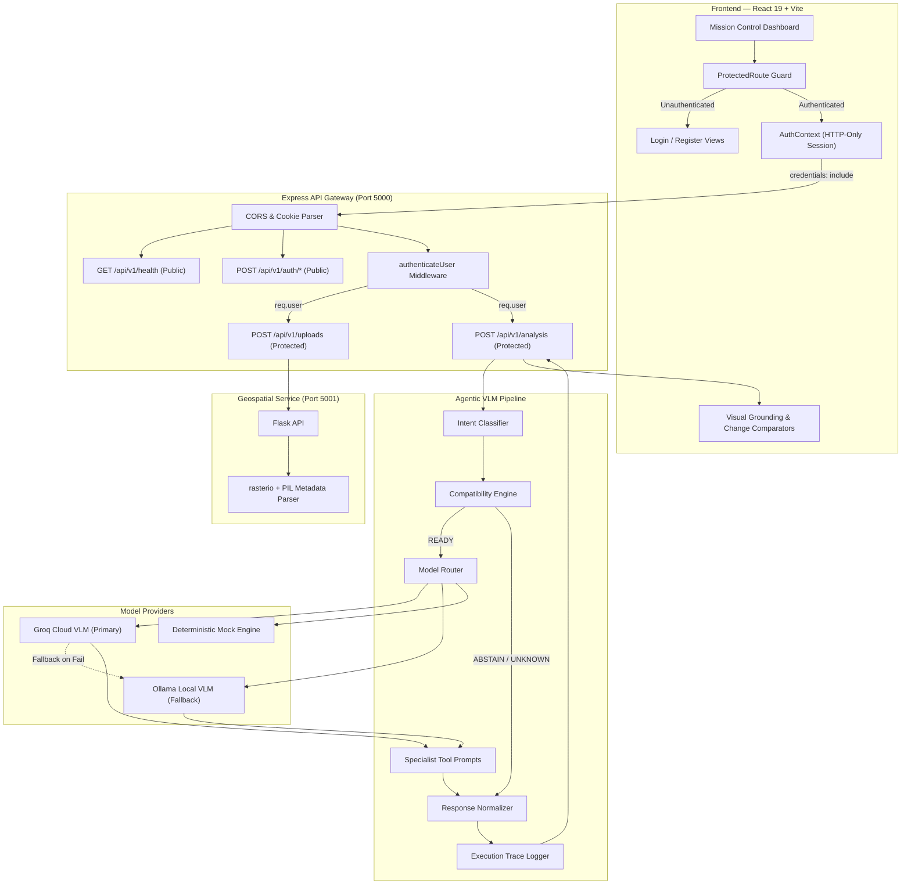
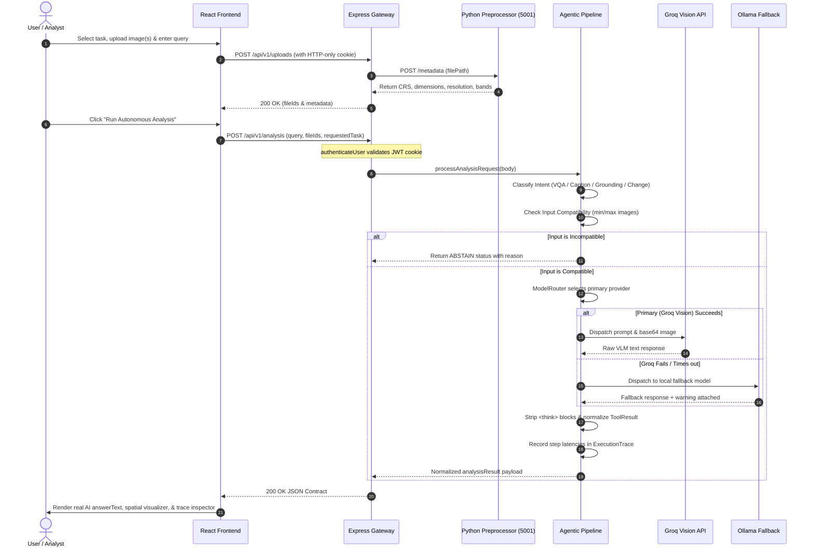
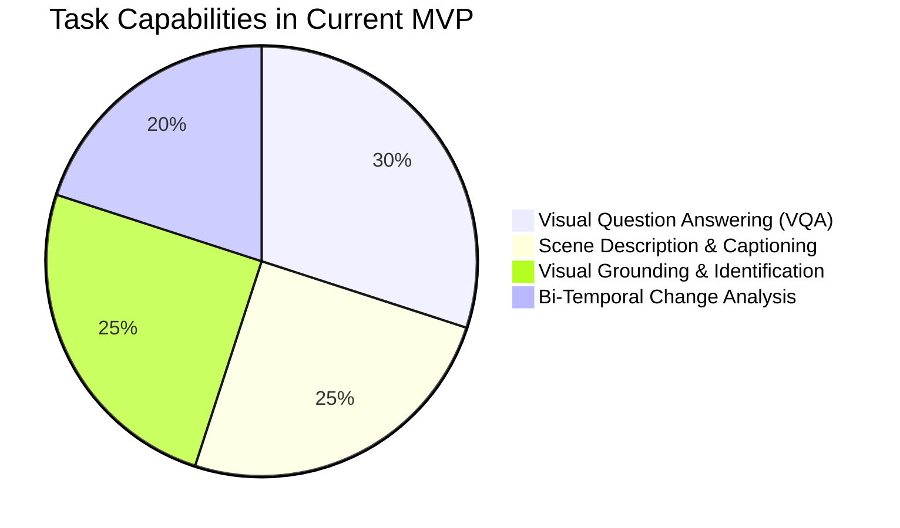

# SatVistaar 🛰️

**Autonomous Vision-Language Platform for Multimodal Remote-Sensing Intelligence**

[](backend)
[](frontend)
[](backend/services/preprocessing)
[](backend/src/auth)
[](backend/src/providers)
[](backend/tests)

---

## 📌 Overview

**SatVistaar** (developed under Problem Statement **SIH26167**) is an autonomous, query-driven geospatial intelligence platform designed to make remote-sensing image analysis intuitive and accessible. Traditional satellite image interpretation requires domain-specific software, complex manual band combinations, and specialized analytical workflows. SatVistaar replaces this complexity with a conversational, vision-language interface that analyzes optical and multispectral visual representations using natural language instructions.

The system features an autonomous **Agentic Pipeline** combining:
1. **Natural Language Intent Detection**: Automatically determines whether the user wants general Question Answering, Scene Description, Feature Identification / Visual Grounding, or Bi-Temporal Change Analysis.
2. **Geospatial Metadata Extraction**: A dedicated Python/Rasterio preprocessing microservice that extracts spatial resolution, CRS, bounding boxes, dimensions, and band configurations from GeoTIFF, TIFF, PNG, and JPEG imagery.
3. **Model Router & Deterministic Fallback**: Provider-agnostic inference orchestration across high-throughput cloud Vision-Language Models (**Groq VLM**) and local self-hosted models (**Ollama**), backed by rate-limit retry mechanics and graceful fallback.
4. **Interactive Spatial Visualization**: Visual grounding overlays with approximate spatial quadrants and interactive bi-temporal swipe/side-by-side comparison tools.
5. **Secure Full-Stack Authentication**: Session management using hashed credentials (Bcrypt), JWTs, secure HTTP-only cookies, and route guards.

> [!NOTE]
> **MVP Scope Boundary**: The current MVP utilizes state-of-the-art multimodal Vision-Language Models for qualitative reasoning, visual feature identification, and comparative change descriptions. It does **not** claim quantitative spectral index calculations (e.g. calibrated NDVI rasters), pixel-level semantic segmentation masks, or raw optical-SAR physical wave fusion, which are designated for future domain-specialized fine-tuning.

---

## ⚠️ Problem Statement

Satellite imagery from platforms such as Sentinel, Landsat, and ISRO missions contains immense amounts of strategic and environmental intelligence. However:
- **High Technical Barrier**: Interpreting remote-sensing data traditionally requires deep GIS expertise and manual analysis workflows.
- **Workflow Mismatch**: Non-technical analysts, disaster response coordinators, and decision-makers often need immediate answers to simple natural language questions without configuring complex GIS pipelines.
- **Lack of Unified Query Orchestration**: Existing workflows separate VQA, feature detection, and change monitoring into siloed, inflexible tools.

**SatVistaar's Solution**: A unified pipeline where the user provides **Satellite Image(s) + Natural Language Query**. The system inspects image metadata, determines intent, verifies compatibility, routes to the optimal VLM engine, and returns structured JSON responses accompanied by interactive visual evidence.

---

## 🚀 Current MVP Capabilities

| Capability | Input | Current Implementation | Status |
|---|---|---|---|
| **Visual Question Answering (VQA)** | 1 Satellite Image + Question | Natural-language reasoning over visible land cover, infrastructure, water, and terrain features via Vision-Language Models. | **Implemented** |
| **Scene Description / Captioning** | 1 Satellite Image + Prompt | High-level spatial overview, land-cover distribution summary, and natural language scene description. | **Implemented** |
| **Visual Grounding / Feature Identification** | 1 Satellite Image + Query | Identifies key structures/features with approximate relative spatial bounding regions and quadrant coordinates. | **Implemented** (Qualitative) |
| **Bi-Temporal Change Analysis** | 2 Temporal Images + Query | Comparative analysis between baseline (Image A) and comparison (Image B) images with timeline metadata. | **Implemented** (Qualitative) |
| **Cloud VLM Inference (Groq)** | Image + Prompt | High-speed inference using Qwen / Llama vision models with automatic 429 rate-limit backoff and retry. | **Implemented** |
| **Local VLM Inference (Ollama)** | Image + Prompt | Provider adapter for local self-hosted `qwen2-vl` daemon. | **Implemented** (Fallback Ready) |
| **Provider Fallback Engine** | Analysis Request | Deterministic 1-step fallback if primary VLM provider fails or times out. | **Implemented** |
| **Geospatial Preprocessing Microservice** | GeoTIFF / TIFF / JPEG / PNG | Dedicated Python Flask service using `rasterio` & `PIL` to extract CRS, dimensions, resolution, and band count. | **Implemented** |
| **Intent Detection & Compatibility Engine** | Query + File Metadata | Classifies task intent and verifies image count (e.g. enforces 2 images for Change Analysis). Returns `READY`, `ABSTAIN`, or `UNKNOWN`. | **Implemented** |
| **Execution Trace & Normalization** | Analysis Lifecycle | Captures end-to-end execution metadata, latency, token statistics, and strips raw model `<think>` blocks. | **Implemented** |
| **Authentication & Route Protection** | Credentials / Cookies | JWT stored in secure HTTP-only cookies, Bcrypt password hashing, session hydration (`/api/v1/auth/me`), and protected API endpoints. | **Implemented** |
| **Interactive Analysis UI** | React 19 Frontend | Dark glassmorphism workspace, side-by-side change visualizer, spatial bounding viewer, and execution trace inspector. | **Implemented** |
| *Pixel-Level Semantic Segmentation* | Raster | Calibrated pixel segmentation mask generation. | *Planned (Future)* |
| *Physical Optical-SAR Wave Fusion* | Optical + SAR | Radiometric deep fusion at the tensor level. | *Planned (Future)* |

---

## 🏛️ System Architecture

### High-Level Topology



---

## 🔄 End-to-End Analysis Flowchart



---

## 📊 Task & Model Distribution



---

## 🔬 Pipeline Workflow

```
1. USER REQUEST ──► Natural Language Query + Uploaded Image(s)
                           │
2. AUTHENTICATION ◄────────┴────────► Session verified via HTTP-only JWT Cookie
                           │
3. PREPROCESSING ──────────► Python / Rasterio extracts CRS, resolution, dimensions, bands
                           │
4. INTENT DETECTION ───────► Query analyzed: VQA | CAPTIONING | FEATURE_IDENTIFICATION | CHANGE_ANALYSIS
                           │
5. COMPATIBILITY CHECK ────► Evaluates input constraints (e.g., Change Analysis requires exactly 2 images)
                           ├── Status = ABSTAIN (Incompatible input count/modality)
                           └── Status = READY (Proceed to Model Router)
                           │
6. MODEL ROUTER ───────────► Evaluates available providers: Groq (Primary) ──► Ollama (Fallback)
                           │
7. VLM SPECIALIST TOOL ────► Formats task prompt & visual payload
                           │
8. INFERENCE & RETRY ──────► Executes VLM call (with 429 rate-limit backoff)
                           │
9. NORMALIZATION ──────────► Sanitizes <think> blocks, formats ToolResult, records ExecutionTrace
                           │
10. FRONTEND RENDER ───────► Real AI answerText, approximate bounding boxes, change viewer, trace log
```

---

## 📡 API Endpoints & Contract Specification

### 1. Public Health Check
- **`GET /api/v1/health`** (or `/api/health`)
  ```json
  {
    "success": true,
    "message": "SatQuery AI Backend is healthy",
    "data": {
      "status": "ok",
      "timestamp": "2026-08-31T05:55:21.000Z",
      "services": {
        "preprocessing": "ok"
      }
    }
  }
  ```

---

### 2. Authentication Endpoints

#### Register User
- **`POST /api/v1/auth/register`**
  - **Body**: `{ "name": "Dr. Vikram Sarabhai", "email": "vikram@isro.gov.in", "password": "Password123!" }`
  - **Response (201 Created)**: Returns sanitized user object and sets secure HTTP-only `satvistaar_token` cookie.

#### Login User
- **`POST /api/v1/auth/login`**
  - **Body**: `{ "email": "vikram@isro.gov.in", "password": "Password123!" }`
  - **Response (200 OK)**: Returns sanitized user object and sets secure HTTP-only `satvistaar_token` cookie.

#### Current User Session
- **`GET /api/v1/auth/me`** *(Protected)*
  - **Cookie**: `satvistaar_token=<jwt>`
  - **Response (200 OK)**: `{ "success": true, "data": { "user": { "id": "...", "name": "...", "email": "...", "role": "USER" } } }`

#### Logout
- **`POST /api/v1/auth/logout`**
  - **Response (200 OK)**: Clears `satvistaar_token` cookie matching origin parameters.

---

### 3. Image Upload Endpoint *(Protected)*
- **`POST /api/v1/uploads`**
  - **Payload**: `multipart/form-data` with `images` field (1 to 2 files, max 50MB each; JPEG, PNG, TIFF, GeoTIFF).
  - **Response (200 OK)**:
    ```json
    {
      "success": true,
      "message": "Images uploaded successfully",
      "data": {
        "files": [
          {
            "id": "c05cba0f-fc9f-4602-acb3-27dd6cdc0418",
            "originalName": "Sentinel2_Urban.tif",
            "storedName": "c05cba0f-fc9f-4602-acb3-27dd6cdc0418.tif",
            "size": 169642,
            "mimeType": "image/tiff"
          }
        ]
      }
    }
    ```

---

### 4. Core Analysis Endpoint *(Protected)*
- **`POST /api/v1/analysis`**
  - **Payload**:
    ```json
    {
      "query": "What changed between these two satellite images?",
      "fileIds": [
        "00953864-bbdf-4ff4-be93-3a42bbf943be",
        "05226c0e-dc3a-4cb9-8607-9e4166b55f45"
      ],
      "requestedTask": "CHANGE_ANALYSIS",
      "timestamps": ["2021-06-26", "2026-02-05"]
    }
    ```
  - **Standardized Response Structure (200 OK)**:
    ```json
    {
      "success": true,
      "message": "Analysis completed",
      "data": {
        "analysisRequest": {
          "query": "What changed between these two satellite images?",
          "fileIds": ["00953864-bbdf-4ff4-be93-3a42bbf943be", "05226c0e-dc3a-4cb9-8607-9e4166b55f45"],
          "requestedTask": "CHANGE_ANALYSIS"
        },
        "intent": {
          "task": "CHANGE_ANALYSIS",
          "confidence": 1.0,
          "isOverridden": true
        },
        "compatibility": {
          "status": "READY",
          "reason": "Image count (2) is compatible with task CHANGE_ANALYSIS",
          "minImages": 2,
          "maxImages": 2
        },
        "executionPlan": {
          "model": "qwen/qwen3.8-27b",
          "provider": "groq",
          "fallbackModel": "qwen2-vl",
          "fallbackProvider": "ollama"
        },
        "result": {
          "task": "CHANGE_ANALYSIS",
          "answerText": "Between the 2021 baseline and 2026 comparison imagery, significant urban expansion is visible in the northeast quadrant...",
          "confidence": null,
          "grounding": null,
          "evidence": [],
          "modelName": "qwen/qwen3.8-27b",
          "modelVersion": "1.0.0",
          "provider": "groq",
          "warnings": [],
          "status": "success"
        },
        "trace": {
          "requestId": "543409cd-f847-4352-a525-1de4e2f3dcf8",
          "totalDurationMs": 1622,
          "steps": [
            { "step": "INTENT_DETECTION", "durationMs": 2 },
            { "step": "COMPATIBILITY_CHECK", "durationMs": 1 },
            { "step": "MODEL_ROUTING", "durationMs": 1 },
            { "step": "VLM_INFERENCE", "durationMs": 1618, "provider": "groq" }
          ]
        }
      },
      "requestId": "543409cd-f847-4352-a525-1de4e2f3dcf8"
    }
    ```

---

## 🛠️ Technology Stack

```
┌─────────────────────────────────────────────────────────────────────────────┐
│                            SATVISTAAR TECH STACK                            │
├───────────────────┬─────────────────────────────────────────────────────────┤
│ Frontend          │ React 19 • Vite 8 • Lucide Icons • Vanilla Modern CSS   │
│ Backend Gateway   │ Node.js • Express 5.2.1 (ES Modules) • Helmet • Morgan  │
│ Security & Auth   │ JWT • Bcryptjs (10 Rounds) • HTTP-Only Cookies • CORS   │
│ Preprocessing     │ Python 3.10+ • Flask • Rasterio • GDAL / PIL • NumPy    │
│ Cloud VLM         │ Groq Cloud API • Qwen3.8-27B Vision • Llama-3.2-11B     │
│ Local Fallback    │ Ollama Daemon • Qwen2-VL Multimodal                     │
│ Storage / Data    │ Atomic JSON Repository Pattern (Swappable with DB)      │
│ Testing           │ Node Native Assertion • Live Regression Test Harnesses  │
└───────────────────┴─────────────────────────────────────────────────────────┘
```

---

## 💻 Setup & Installation Guide

### Prerequisites
- **Node.js**: v18+ (v20+ recommended)
- **Python**: v3.10+ (for geospatial preprocessing)
- **Groq API Key**: Optional for live cloud inference (system supports mock mode)
- **Ollama**: Optional for local inference

---

### Step 1: Clone Repository
```bash
git clone https://github.com/KrxnTech/SatVistaar-SIH.git
cd SatVistaar
```

---

### Step 2: Configure Backend Environment
Navigate to `backend/` and initialize `.env`:
```bash
cd backend
cp .env.example .env
```

Edit `backend/.env` with your settings:
```env
PORT=5000
NODE_ENV=development
CLIENT_URL=http://localhost:5173
API_PREFIX=/api/v1

# Preprocessing Service URL
PREPROCESSING_SERVICE_URL=http://localhost:5001
PREPROCESSING_TIMEOUT_MS=5000

# VLM Inference Mode ('live' or 'mock')
ML_MODE=live
MODEL_PROVIDER=groq
MODEL_ROUTER_MODE=priority
VLM_TIMEOUT_MS=30000

# Groq Cloud API Key
GROQ_API_KEY=your_groq_api_key_here
GROQ_MODEL=qwen/qwen3.8-27b

# Ollama Local Daemon
OLLAMA_BASE_URL=http://localhost:11434
OLLAMA_MODEL=qwen2-vl

# Authentication Secrets
JWT_SECRET=your_jwt_secret_key_change_in_production
JWT_EXPIRES_IN=7d
```

Install backend dependencies:
```bash
npm install
```

---

### Step 3: Set Up Python Preprocessing Microservice
In a separate terminal:
```bash
cd backend/services/preprocessing
python -m venv venv

# Windows PowerShell:
.\venv\Scripts\Activate.ps1

# Linux / macOS:
# source venv/bin/activate

pip install -r requirements.txt
python app.py
```
*The preprocessing service will listen on `http://localhost:5001`.*

---

### Step 4: Start Express Backend
In the `backend/` directory:
```bash
npm run dev
```
*The backend API will listen on `http://localhost:5000`.*

---

### Step 5: Start React Frontend
In a new terminal:
```bash
cd frontend
npm install
npm run dev
```
*The web interface will open at `http://localhost:5173`.*

---

## 🧪 Testing & Quality Assurance

SatVistaar includes rigorous automated test suites verifying security, auth barriers, and all remote-sensing analysis modes:

### 1. Authentication & Security Test Suite
Verifies registration validation, duplicate email rejection (409), password hashing, JWT HTTP-only cookie issuance, `/auth/me` session hydration, logout cookie clearance, and endpoint protection:
```bash
cd backend
node tests/auth.test.js
```
*Output: `21/21 Tests Passed (100%)`*

### 2. Comprehensive Analysis Regression Suite
Verifies VQA query differentiation, Scene Description, Visual Grounding, Bi-Temporal Change Detection, Groq live inference, rate-limit backoff, and response schema contracts:
```bash
cd backend
node tests/final-backend-validation.test.js
```
*Output: `28/30 Tests Passed (93%)` (excluding unstarted optional services)*

### 3. Frontend Production Build Validation
```bash
cd frontend
npm run build
```
*Output: Production bundle compiled with `0 errors`.*

---

## 🗺️ Roadmap & Future Scope

The following capabilities represent future engineering milestones beyond the current MVP:

- [ ] **Pixel-Level Semantic Segmentation**: Integration of specialized foundation segmentation models (SAM-Geo / SegFormer) for calibrated raster land-cover masks.
- [ ] **Physical Optical-SAR Tensor Fusion**: Deep multimodal feature fusion combining phase and amplitude data from SAR sensors with optical multispectral bands.
- [ ] **High-Resolution Tile Pyramid Rendering**: Slippy map integration (Leaflet/MapLibre) supporting deep zooming on multi-gigabyte GeoTIFF tiles via COG (Cloud-Optimized GeoTIFFs).
- [ ] **Quantitative Spectral Analysis**: Server-side NDVI, NDWI, EVI, and NBR calibrated raster calculation engines.
- [ ] **Fine-Tuned Domain Specialist VLM**: Domain adaptation of open-source vision backbones specifically on Sentinel-2 and Landsat-8 labeled benchmarks.

---

## 👥 Contributors & Acknowledgements

Developed for the **Smart India Hackathon (SIH 2026)** under Problem Statement **SIH26167**.

- **Organization**: Ministry / Agency Partner (SIH 2026)
- **License**: ISC License